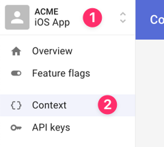
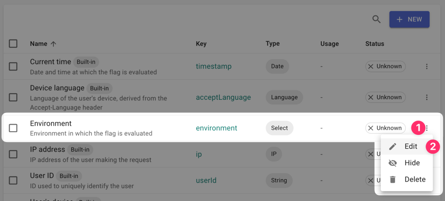
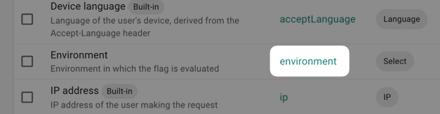
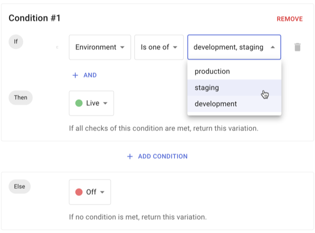
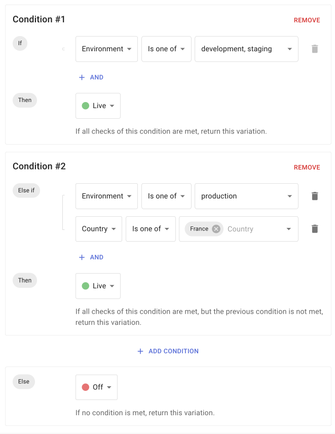

# Environments

## Overview

This section explains how to integrate development environments with Tggl and
use them in your segmentation to enable features based on if the user is in
production, staging, or local development environments. 

You are **not limited** in the number of environment you can have and can 
very easily switch or share logic between environments.

It is also important to note that environments are set for each project, 
meaning that you can have a completely different set of environment between 
your web application and your iOS or Android app.

## Setting up your environments

By default, each project comes with three environments:
- `production`
- `staging`
- `development`

If you need to add or rename environments to fit you existing workflow, 
start by selecting your project in the upper left corner and go to the 
_context_ menu.



Edit the _Environment_ property to add / rename environments as needed and 
hit _Update_.



## Passing the environment from your code

In your code you simply need to pass the environment as a context key. For 
Node.js this might look like this id the environment can be retrieved from 
en env-var:
```ts
await client.setContext({
  environment: process.env.environment,
  // Other context properties like userId, email...
})
```

Here we use the `environment` key because it is the one we setted up in Tggl 
as shown on the screenshot below. You can use any key you want by changing 
it on the Tggl app.



## How to enable features for specific environments only

Create a feature flag and use the environment in your conditions to 
enable it for specific environments only. Here we enabled the feature only for 
staging and development:



## How to conditionally enable features based on the environment

You can add more complex logic to you feature flag's conditions. In this 
example we enabled the feature for all users in development and staging, and 
only enabled it for France in production.

