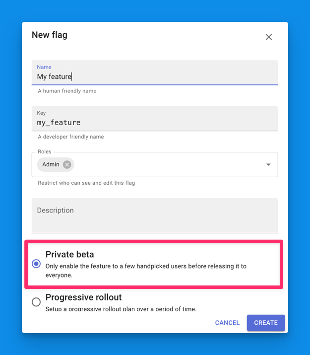
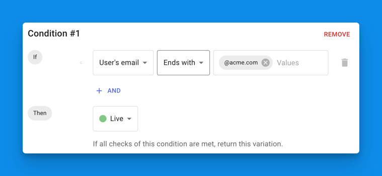
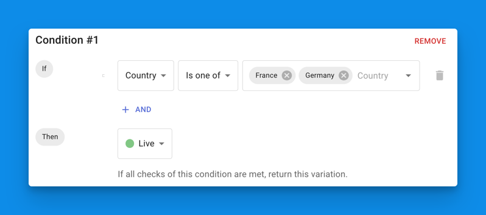
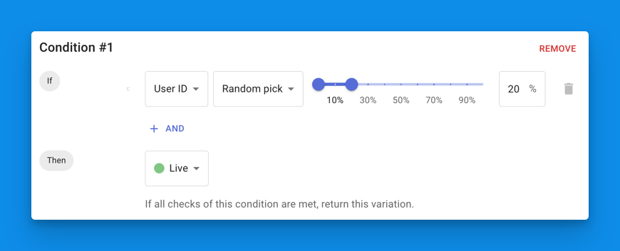

# Progressive rollout

## Overview

Progressive rollout is a technique used to gradually introduce new features 
to your app while minimizing risk and ensuring a smooth user experience.

In practice, it allows you to release new features to a subset of users or a 
small percentage of the overall user base, monitor their impact, and gradually
increase the rollout as confidence in the feature grows.

This approach will allow you to catch and address issues early, reduce the 
risk of introducing bugs or disruptions, and get feedback from users before 
a full rollout is implemented. 

## Beta-testing a feature on specific users

It is often a good idea to test a new feature on a small subset of users 
that you handpick. This allows you to get feedback from users that are close 
to you and that you trust.

This is very straight forward to do with Tggl, simply create a flag and 
choose the **Private beta** template:

This template automatically crates a condition where all users having their 
email ending with `@acme.com` will be included in the rollout. You can 
replace this condition with the domain of you company to test the feature 
internally, or you can manually list emails of users that you want to 
include to be more specific:

Once you are confident that the feature works as expected in production, you 
can move on 
to a more advance rollout strategy bellow.

## How to roll out a feature by country?

If you operate in multiple countries, you may want to roll out new feature 
one country at a time, at least in the beginning. This allows you to spot 
issues early on without impacting your entire user base.

From the Tggl app simply create a flag and choose the **Private beta** template.
Then update the condition to select the countries you want to include in the 
rollout:

Here we chose to release our feature in two countries. You can add more 
countries to the list once you are ready to expand.

## How to roll out a feature to a small percentage of users?

Sometimes rolling out by country is not possible or too drastic. Or you may 
want to test your feature on small volumes before rolling it out to a larger 
audience to slowly test if your infrastructure can hold the load.

In this situation you cannot handpick the users or the country, you have to 
randomly assign users to either see the feature or not see the feature. This 
can be complex because you want to make sure of two fundamental things:

- The same user is always assigned to the same [variation](../concepts/variations). 
  This is to 
  ensure 
  that the user experience is consistent and that the user is not confused 
  by the feature appearing and disappearing randomly when refreshing the 
  page or re-starting the app. This is called **stickyness**.
- The distribution of users is uniform and completely decorrelated from other 
  features. This is to ensure that the feature is not over-represented in 
  some segments of the user base and under-represented in others. And if two 
  features are rolling out at the same time, that they don't interfere with 
  each other.

Thankfully Tggl takes care of all of this for you. The only thing you have 
to worry about is which [property of the context](../concepts/context) to base 
the 
stickyness on?

- If you want to roll out the feature on **logged-in** users, you can use the 
  `userId` property of the context. This will ensure that the same user 
  always sees the same variation, even when switching device.
- If you want to roll out the feature on **anonymous** users, you can use a
  session ID stored in a cookie, or use a device ID if you are on mobile. The only downside of this approach is that if the user switches device,
  or clears its cookies, it might be assigned to a different variation. 

Once you have decided on the property to use, simply create a flag and set 
it up like so:

Here our feature is rolled out to 20% of the users. You can increase this 
value as time passes until you reach 100%. 

## Scheduling a progressive rollout

The progressive rollout strategy makes you come back to Tggl a few times to 
add more users or increase the percentage of users that see the feature as 
time passes. This can be tedious and repetitive.

Thankfully Tggl allows you to schedule a progressive rollout plan over any 
period 
of time and automatically increase the percentage of users that see the 
feature at predefined intervals. See the 
[release schedule](./release-schedule.md) section for more details.