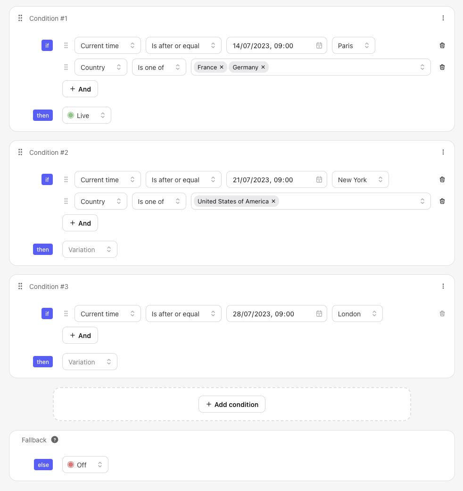
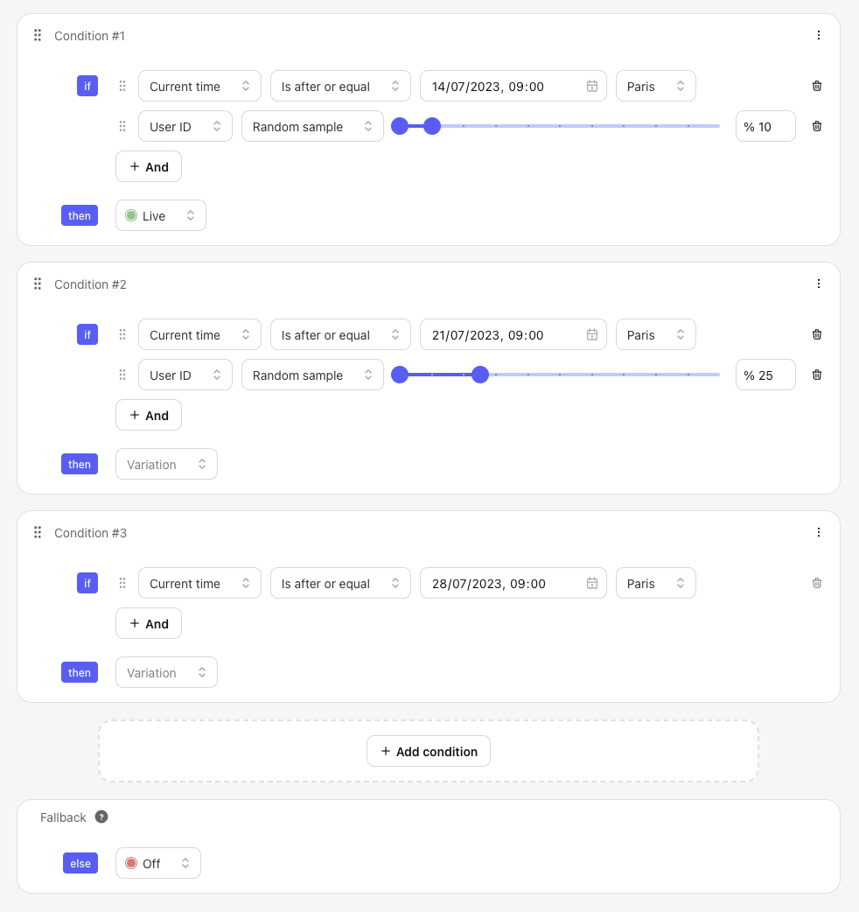

# Release schedule

## Overview

Feature flags allow you to decorrelate code deployment from feature release. 
This means that you can schedule feature releases in advance right from Tggl 
and have them automatically deployed to production at the right time.

## Release a feature on a specific date

This is the simplest form a scheduling, we simply want the feature to be 
live at a given date and time. Create a new flag and set it up like so:

<Image img={require('./assets/release-date@2x.png')} padding="l" />

The timezone of your browser will automatically be selected. Not that 
current time is automatically added to the [context](../concepts/context), your app 
does not need to explicitly add it.

## Release a feature on different dates by country

Having a different release date for each country is a common use case. With 
Tggl simply add one condition per release date and select the countries 
where the feature should be released:

Here our feature follows the schedule below:
- On July 14, our feature is released for France and Germany at 9:00 Paris time
- Then, On July 21, our feature is released for the States at 9:00 NY time
- Finally, our feature is released to everyone on July 28 at 9:00 London 
  time (Notice that we did not add any condition on the country for this date)

It is important to note that the _Else_ variation is Off, meaning that if 
none of the conditions above are met, the feature will be off.

## Schedule a progressive rollout over time

Scheduling a progressive rollout is similar to scheduling by country. We 
create one condition per date and select the percentage of users that should 
see the feature for each date:

- On July 14, 10% of the users will see the feature
- One week later, on July 21, 25% of the users will see the feature: the 10% 
  who where already seeing the feature will continue to see it, and and 
  additional 15% will be added
- And finally, on July 28, 100% of the users will see the feature